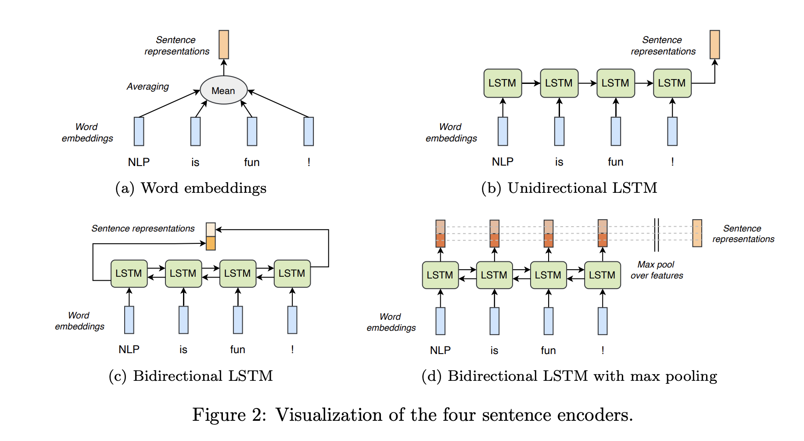

 # Learning sentence representations from natural language inference data   
 
## Description   

The first practical of the Advanced Topics in Computational Semantics course concerns learning
general-purpose sentence representations in the natural language inference (NLI) task. The goal
of this practical is threefold:
• to implement four neural models to classify sentence pairs based on their relation;
• to train these models using the Stanford Natural Language Inference (SNLI) corpus (Bowman
et al., 2015);
• and to evaluate the trained models using the SentEval framework (Conneau and Kiela, 2018).
NLI is the task of classifying entailment or contradiction relationships between premises and
hypotheses, such as the following:
Premise Bob is in his room, but because of the thunder and lightning outside, he cannot sleep.
Hypothesis 1 Bob is awake.
Hypothesis 2 It is sunny outside.
Hypothesis 3 Bob is lying in his bed.
While the first hypothesis follows from the premise, indicated by the alignment of ‘cannot sleep’
and ‘awake’, the second hypothesis contradicts the premise, as can be seen from the alignment of
‘sunny’ and ‘thunder and lightning’ and recognizing their incompatibility. The third hypothesis is
not necessarily entailed by the premise, and neither is contradicted. Therefore, its relation to the
premise is considered to be neutral.
For a model to recognize textual entailments, it has to reason about semantic relationships
within sentences. Hence, a thorough understanding of natural language is required which can be
transferred to other tasks involving natural language. In this assignment, we focus on pretraining
a sentence encoder on NLI, and afterwards evaluate its sentence embeddings on a variety of natural
language tasks.

## How to run   
First, install dependencies   
```bash
# clone project   
git clone https://github.com/fanminshi/acts-lstm

# install project   
cd acts-lstm
pip install -e .   
pip install -r requirements.txt
 ```   
 Next, navigate to any file and run it.   
 ```bash
# module folder
cd project

# train avg encoder and save the model to ./models directory
python train.py --encoder=avg --save_dir="./models"   
```

## Train Models

We have 4 models to train mean embeddinng, LSTM, Bi-LSTM, and Bi-LSTM with Max pooling.



Train 4 models with the follwing commands.

```
$ cd <project-root-folder>
# Mean embedding
$ python train.py --encoder=bi-lstm --batch-size=64 --save_dir='./models'

# LSTM
$ python train.py --encoder=lstm --batch-size=64 --save_dir='./models'

# Bi-LSTM
$ python train.py --encoder=bi-lstm --batch-size=64 --save_dir='./models'

# Bi-LSTM with Max Pooling
$ python train.py --encoder=bi-lstm --batch-size=64 --save_dir='./models'
```

You can view the saved check pts and tensorboard logging as the following

```
$ tree models
models
├── avg # tensorboard logging for encoder avg
│   └── version_0
│       ├── events.out.tfevents.1713785131.fanmin-ml-rig.2717805.0
│       ├── events.out.tfevents.1713785275.fanmin-ml-rig.2717805.1
│       └── hparams.yaml
|   # model check point for encoder avg. It contains useful info such as epoch, val loss, and val acc.
├── avg-epoch=19-val_loss=0.66-val_accuracy=0.72.ckpt
...
```
## Pretrained models + tensorboard log

All the pretrained models are uploaded here https://drive.google.com/drive/folders/1Uw0TrcW3uCpcX5Hp9Vy5WeMWPv8k7GMY?usp=drive_link

And all the logs are in https://drive.google.com/drive/folders/1Uw0TrcW3uCpcX5Hp9Vy5WeMWPv8k7GMY?usp=drive_link


## SentEval

First, you need to install SentEval first.

```
$ pip install -e SentEval 
```

Second, you need to downlad the sentval dataset first.

```
$ cd atcs-lstm/SentEval/data/downstream
$ ./get_transfer_data.bash
```

Then you can run sentval on trained model

```
python train.py --senteval --checkpt='<model>.ckpt' --encoder=<type>
```


## Run Experiments 

The `atcs-lstm/run.ipynb` contains the code to train the model and run the senteval.
